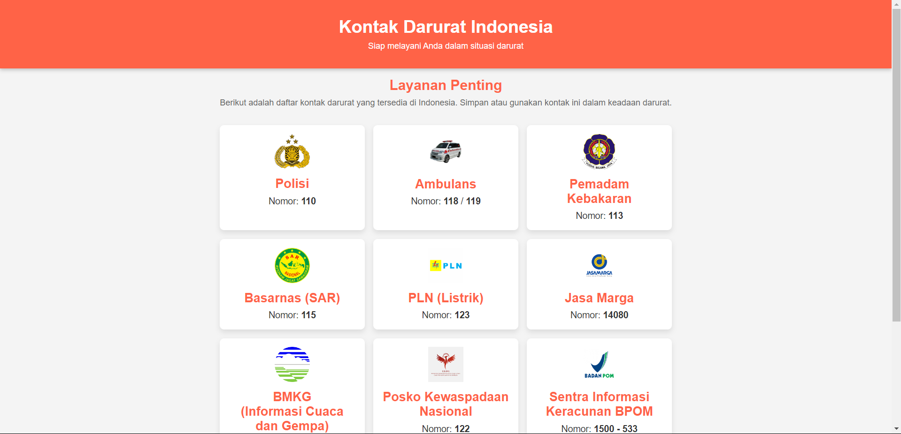

# Aplikasi Pencatat Nomor Darurat di Indonesia

## Deskripsi
Aplikasi Pencatat Nomor Darurat adalah aplikasi berbasis web yang dirancang untuk membantu pengguna di Indonesia menyimpan dan mengelola nomor darurat penting. Aplikasi ini juga dilengkapi dengan fitur untuk mencatat nomor orang terdekat yang dapat dihubungi sebagai darurat alternatif.

## Fitur
- **Penyimpanan Nomor Darurat**: Simpan nomor-nomor darurat penting seperti ambulans, pemadam kebakaran, dan polisi.
- **Catatan Kontak Darurat Alternatif**: Simpan nomor kontak orang terdekat yang dapat dihubungi dalam situasi darurat.
- **Antarmuka yang User-Friendly**: Desain yang sederhana dan mudah digunakan untuk semua kalangan.
- **Keamanan Data**: Data pengguna disimpan dengan aman menggunakan SQLite untuk menjaga privasi dan kerahasiaan.

## Lampiran



## Teknologi yang Digunakan
- **HTML**: Untuk struktur halaman web.
- **CSS**: Untuk desain dan tata letak.
- **PHP**: Untuk pengolahan data dan interaksi dengan database.
- **SQLite**: Untuk penyimpanan data lokal.

## Instalasi
1. Clone repositori ini:
   ```bash
   git clone https://github.com/rffdpryt/Catatan_Nomor_Darurat.git
